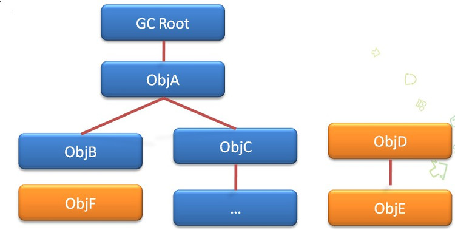
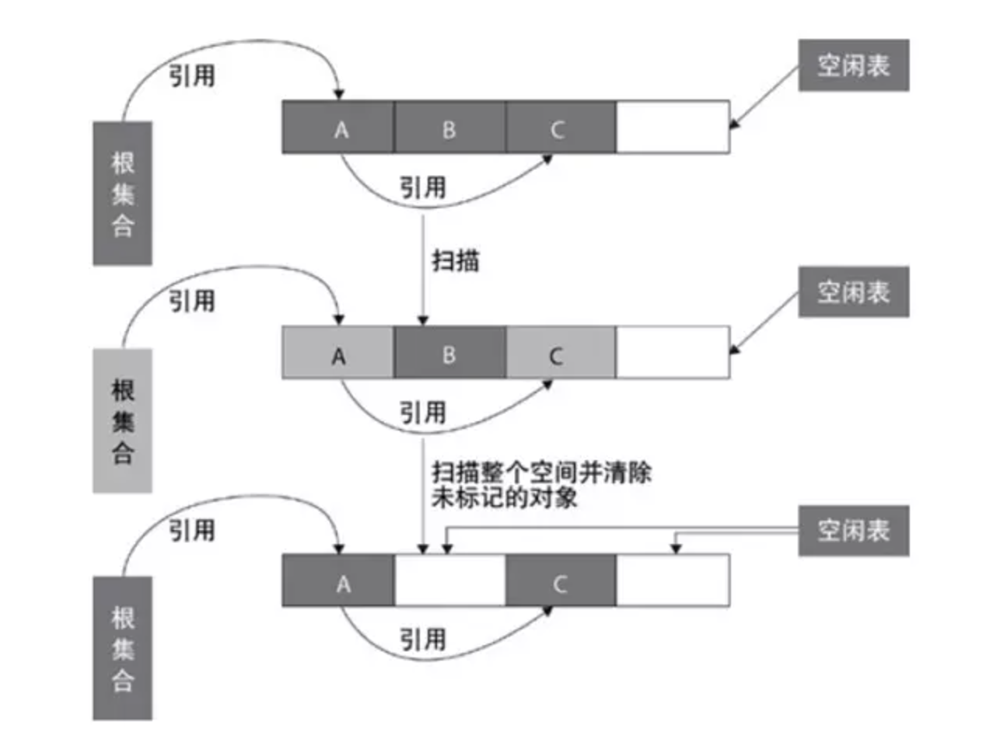
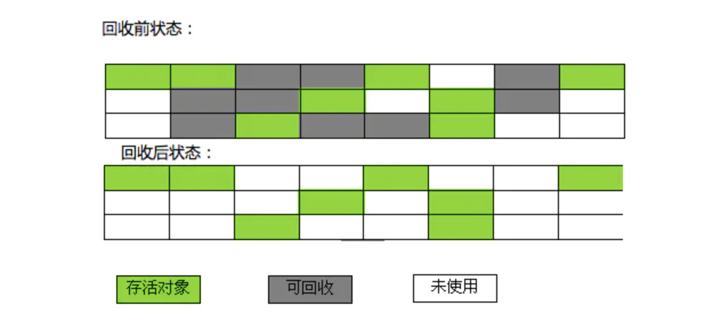
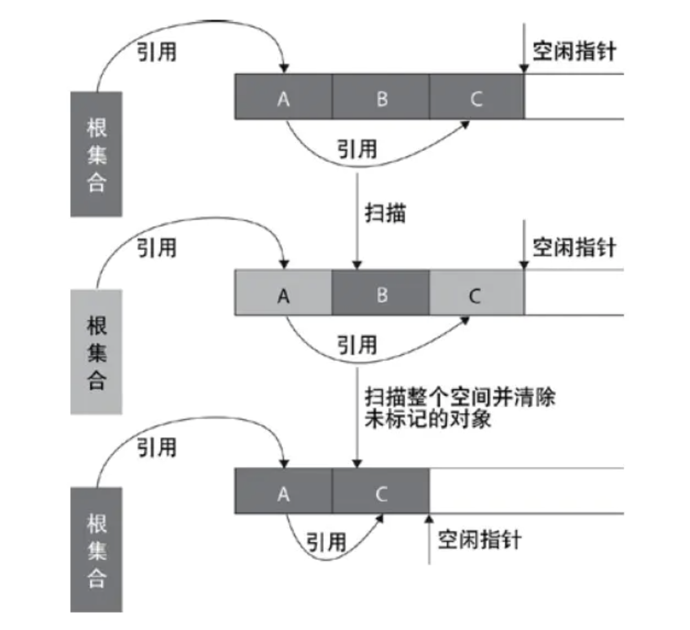
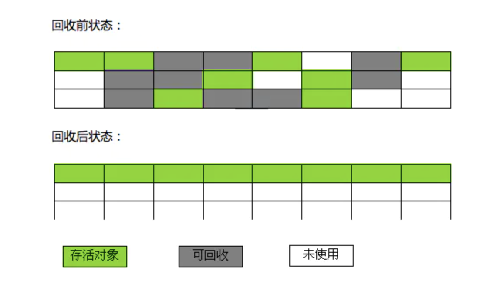
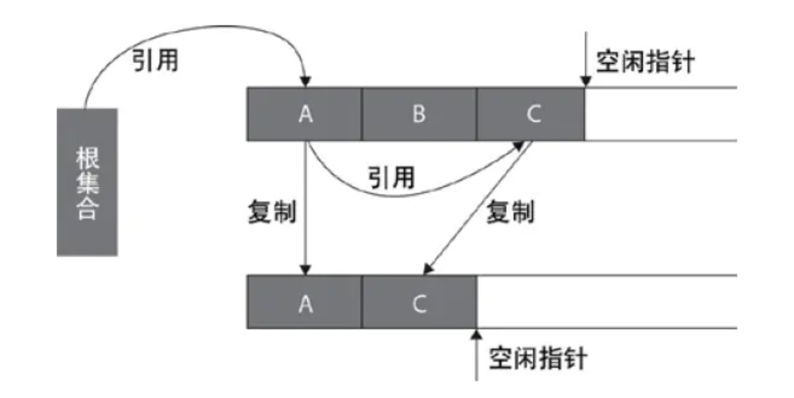
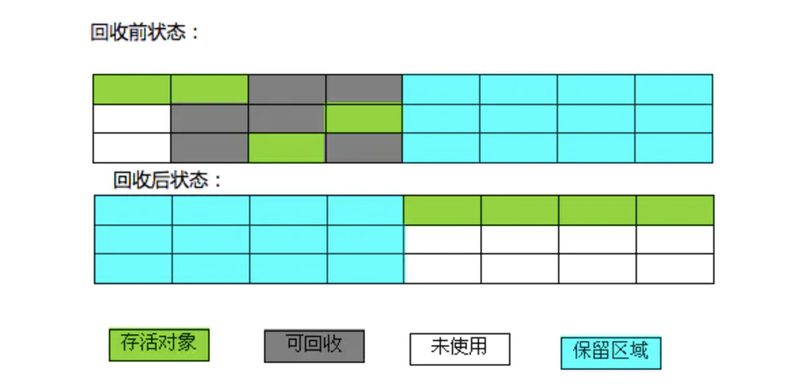
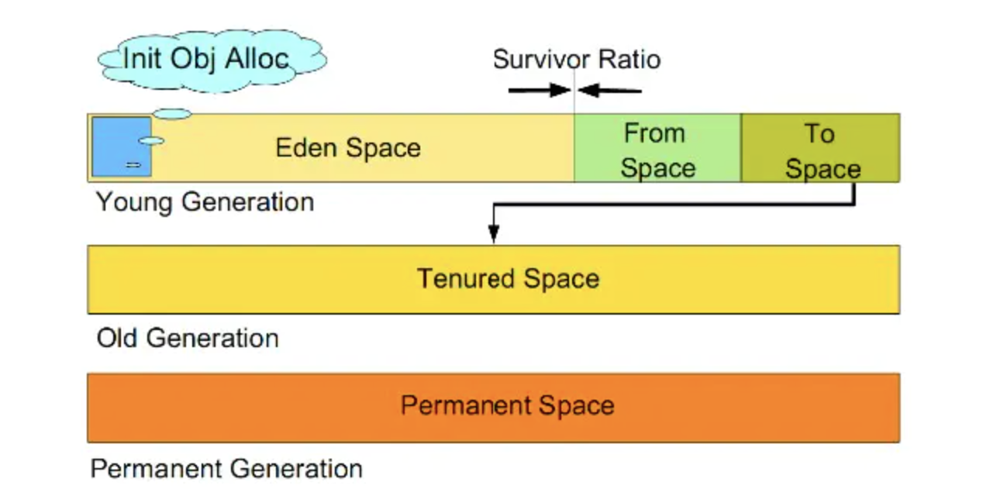

[toc]
#Java的垃圾回收机制
垃圾收集GC（Garbage Collection）是Java语言的核心技术之一， 在Java中，程序员不需要去关心内存动态分配和垃圾回收的问题，这一切都交给了JVM来处理。针对GC我们这篇文章提出以下几个问题，GC中判定为垃圾的标准，标记垃圾的算法以及回收垃圾的算法。

##什么样的对象才是垃圾？  
这个问题其实很简单，对于Java对象来讲，如果说这个对象没有被其他对象所引用该对象就是无用的，此对象就被称为垃圾，其占用的内存也就要被销毁。那么自然而然的就引出了我们的第二个问题，判断对象为垃圾的算法都有哪些？

##标记垃圾的算法  
Java中标记垃圾的算法主要有两种：   
+ 引用计数法  
+ 可达性分析算法

###引用计数法
**引用计数法就是给对象中添加一个引用计数器，每当有一个地方引用它，计数器就加 1；当引用失效，计数器就减 1；任何时候计数器为 0 的对象就是不可能再被使用的，可以当做垃圾收集。这种方法实现起来很简单而且优缺点都很明显。**
**优点 执行效率高，程序执行受影响较小**  
**缺点 无法检测出循环引用的情况，导致内存泄露**

循环引用：  
```java
public class MyObject {
    public MyObject childNode;
}

public class ReferenceCounterProblem {
    public static void main(String[] args) {
        MyObject object1 = new MyObject();
        MyObject object2 = new MyObject();
        object1.childNode = object2;
        object2.childNode = object1;
        
        object1 = null;
        object2 = null;
    }
}
```
> <font color = "red">**最后面两句将object1和object2赋值为null，也就是说object1和object2指向的对象已经不可能再被访问，但是由于它们互相引用对方，导致它们的引用计数器都不为0，那么垃圾收集器就永远不会回收它们。**</font>  
从上述代码中我们可以看出，object1和object2并没有任何价值，但是他们循环引用(object1里有object2的引用，object2里有object1的引用，无限循环)，造成内存泄露。

###可达性分析法(根搜索算法)  
> **这个算法的基本思想就是通过一系列的称为 “GC Roots” 的对象作为起点，从这些节点开始向下搜索，节点所走过的路径称为引用链，当一个对象到 GC Roots 没有任何引用链相连的话，则证明此对象是不可用的。**  

那么什么对象可以作为GCRoot？
- 虚拟机栈中的引用对象
- 方法区中的常量引用对象
- 方法区中的类静态属性引用对象
- 本地方法栈中的引用对象 
- 活跃线程（已启动且未停止的 Java 线程） 

根搜索算法算法如下图所示


**在根搜索算法中，要真正宣告一个对象死亡，至少要经历两次标记过程：**  
- 如果对象在进行根搜索后发现没有与根对象相连接的引用链，那它会被第一次标记并且进行一次筛选。筛选的条件是此对象是否有必要执行 finalize()方法（可看作析构函数，类似于 OC 中的dealloc，Swift 中的deinit）。当对象没有覆盖finalize()方法，或finalize()方法已经被虚拟机调用过，虚拟机将这两种情况都视为没有必要执行。  
- 如果该对象被判定为有必要执行finalize()方法，那么这个对象将会被放置在一个名为F-Queue的队列中，并在稍后由一条由虚拟机自动建立的、低优先级的Finalizer线程去执行finalize()方法。finalize()方法是对象逃脱死亡命运的最后一次机会（因为一个对象的finalize()方法最多只会被系统自动调用一次），稍后 GC 将对F-Queue中的对象进行第二次小规模的标记，如果要在finalize()方法中成功拯救自己，只要在finalize()方法中让该对象重新引用链上的任何一个对象建立关联即可。而如果对象这时还没有关联到任何链上的引用，那它就会被回收掉。

**GC 判断对象是否可达看的是强引用** 
> 在上面的介绍中，我们多次提到了“引用”这个概念，在此我们不妨多了解一些引用的知识，在 Java 中有四种引用类型，分别为：  
> - 强引用（Strong Reference）：如Object obj = new Object()，这类引用是 Java 程序中最普遍的。只要强引用还存在，垃圾收集器就永远不会回收掉被引用的对象。
> - 软引用（Soft Reference）：它用来描述一些可能还有用，但并非必须的对象。在系统内存不够用时，这类引用关联的对象将被垃圾收集器回收。JDK1.2 之后提供了SoftReference类来实现软引用。
> - 弱引用（Weak Reference）：它也是用来描述非必须对象的，但它的强度比软引用更弱些，被弱引用关联的对象只能生存到下一次垃圾收集发生之前。当垃圾收集器工作时，无论当前内存是否足够，都会回收掉只被弱引用关联的对象。在 JDK1.2 之后，提供了WeakReference类来实现弱引用。
> - 虚引用（Phantom Reference）：也称为幻引用，最弱的一种引用关系，完全不会对其生存时间构成影响，也无法通过虚引用来取得一个对象实例。为一个对象设置虚引用关联的唯一目的是希望能在这个对象被收集器回收时收到一个系统通知。JDK1.2 之后提供了PhantomReference类来实现虚引用。

当标记阶段完成后，GC 开始进入下一阶段，删除不可达对象。当然，可达性分析法有优点也有缺点，  
优点：可以解决循环引用的问题，不需要占用额外的空间  
缺点：多线程场景下，其他线程可能会更新已经访问过的对象的引用

##垃圾回收
###垃圾回收算法
####标记-清除算法
>标记-清除（Tracing Collector）算法是最基础的收集算法，为了解决引用计数法的问题而提出。它使用了根集的概念，它分为“标记”和“清除”两个阶段：首先标记出所需回收的对象，在标记完成后统一回收掉所有被标记的对象，它的标记过程其实就是前面的可达性分析法中判定垃圾对象的标记过程.    

优点：不需要进行对象的移动，并且仅对不存活的对象进行处理，在存活对象比较多的情况下极为高效。  
缺点：标记和清除过程的效率都不高，这种方法需要使用一个空闲列表来记录所有的空闲区域以及大小，对空闲列表的管理会增加分配对象时的工作量；标记清除后会产生大量不连续的内存碎片，虽然空闲区域的大小是足够的，但却可能没有一个单一区域能够满足这次分配所需的大小，因此本次分配还是会失败，不得不触发另一次垃圾收集动作。  

下图为“标记-清除”算法的示意图：  


下图为使用“标记-清除”算法回收前后的状态:


####标记-整理算法
>标记-整理（Compacting Collector）算法标记的过程与“标记-清除”算法中的标记过程一样，但对标记后出的垃圾对象的处理情况有所不同，在回收不存活的对象占用的空间后，会将所有的存活对象往左端空闲空间移动，并更新对应的指针。标记-整理算法是在标记-清除算法的基础上，又进行了对象的移动，因此成本更高，但是却解决了内存碎片的问题。在基于Compacting算法的收集器的实现中，一般增加句柄和句柄表

优点：经过整理之后，新对象的分配只需要通过指针碰撞便能完成，比较简单；使用这种方法，空闲区域的位置是始终可知的，也不会再有碎片的问题了。  
缺点：GC 暂停的时间会增长，因为你需要将所有的对象都拷贝到一个新的地方，还得更新它们的引用地址。

下图为“标记-整理”算法的示意图：


下图为使用“标记-整理”算法回收前后的状态：


####复制算法  
>复制（Copying Collector）算法的提出是为了克服句柄的开销和解决堆碎片的垃圾回收。它将内存按容量分为大小相等的两块，每次只使用其中的一块（对象面），当这一块的内存用完了，就将还存活着的对象复制到另外一块内存上面（空闲面），然后再把已使用过的内存空间一次清理掉。  
复制算法比较适合于新生代（短生存期的对象），在老年代（长生存期的对象）中，对象存活率比较高，如果执行较多的复制操作，效率将会变低，所以老年代一般会选用其他算法，如“标记-整理”算法。一种典型的基于复制算法的垃圾回收是stop-and-copy算法，它将堆分成对象区和空闲区，在对象区与空闲区的切换过程中，程序暂停执行。

优点：标记阶段和复制阶段可以同时进行；每次只对一块内存进行回收，运行高效；只需移动栈顶指针，按顺序分配内存即可，实现简单；内存回收时不用考虑内存碎片的出现。  
缺点：需要一块能容纳下所有存活对象的额外的内存空间。因此，可一次性分配的最大内存缩小了一半。  

下图为复制算法的示意图：


下图为使用复制算法回收前后的状态：  


####分代收集算法
>分代的垃圾回收策略，是基于这样一个事实：**不同的对象的生命周期是不一样的**。因此，不同生命周期的对象可以采取不同的回收算法，以便提高回收效率



#####年轻代（Young Generation）
　　1. 所有新生成的对象首先都是放在年轻代的。年轻代的目标就是尽可能快速的收集掉那些生命周期短的对象。  
　　2. 新生代内存按照8:1:1的比例分为一个eden区和两个survivor(survivor0,survivor1)区。一个Eden区，两个 Survivor区(一般而言)。大部分对象在Eden区中生成。回收时先将eden区存活对象复制到一个survivor0区，然后清空eden区，当这个survivor0区也存放满了时，则将eden区和survivor0区存活对象复制到另一个survivor1区，然后清空eden和这个survivor0区，此时survivor0区是空的，然后将survivor0区和survivor1区交换，即保持survivor1区为空， 如此往复。  
　　3. 当survivor1区不足以存放 eden和survivor0的存活对象时，就将存活对象直接存放到老年代。若是老年代也满了就会触发一次Full GC，也就是新生代、老年代都进行回收  
　　4. 新生代发生的GC也叫做Minor GC，MinorGC发生频率比较高(不一定等Eden区满了才触发)

#####年老代（Old Generation）
　　1.在年轻代中经历了N次垃圾回收后仍然存活的对象，就会被放到年老代中。因此，可以认为年老代中存放的都是一些生命周期较长的对象。  
　　2.内存比新生代也大很多(大概比例是1:2)，当老年代内存满时触发Major GC即Full GC，Full GC发生频率比较低，老年代对象存活时间比较长，存活率标记高。

#####持久代（Permanent Generation）
　　用于存放静态文件，如Java类、方法等。持久代对垃圾回收没有显著影响，但是有些应用可能动态生成或者调用一些class，例如Hibernate 等，在这种时候需要设置一个比较大的持久代空间来存放这些运行过程中新增的类。


