# Spring相关

[toc]


## Spring配置文件

### spring标签基本配置

用于配置对象交由Sring来创建；

默认情况下它调用的是类中的无参构造函数，如果没有无参构造函数则不能创建成功。

基本属性

* id：Bean实例在Spring容器中的唯一标识
* class：Bean的全限定名称

### Bean标签范围配置

scope: 指对象的作用范围，取值如下

* singleton:默认的，单例的；
  实例化个数：1
  实例化时机：当Spring核心文件被加载时，实例化配置的Bean实例
  生命周期：
  对象创建：当应用加载，创建容器时，实例化配置Bean实例
  对象运行：只要容器在，对象一直活着
  对象销毁：当应用卸载，销毁容器时，对象被销毁
* prototype:多例的；  新建对象为不同地址
  实例化个数：多个
  实例化时机：当调用getBean()方法时，实例化配置的Bean实例
  生命周期：
  对象创建：当使用对象时，创建对象实例
  对象运行：只要对象使用中，就一直活着
  对象销毁：当对象长时间不用，会被Java的垃圾回收器回收掉
* request:Web项目中，spring创建一个bean对象，将该对象传入request域中；
* session:Web项目中，spring创建一个bean对象，将该对象传入session域中；
* global session： Web项目中，应用在Portlet环境，如果没有Portlet环境那么global Session相当于session

### Bean生命周期配置
* init-method:初始化方法

* destroy-method:销毁方法 

  <font color = "red">销毁时要用转成父类使用父类的close方法,并且此时注入的对象为单例模式</font>

  ```java
  ApplicationContext app = new ClassPathXmlApplicationContext("applicationContext.xml");
  UserService userService = app.getBean(UserService.class);
  userService.save();
  ((ClassPathXmlApplicationContext)app).close();
  ```

  

### Bean实例化的三种方式

* 无参构造方法实例化
* 工厂静态方法实例化 
  设置factory-method指向对应工厂类的静态方法
* 工厂实例方法实例化
  工厂实例方法 先创建工厂的实例然后 factory-bean 和factory-method去创建

### Bean的依赖注入分析

依赖注入：它是Spring核心框架IOC的具体实现

在编写程序是通过控制反转，将对象的创建交给Spring，但是代码中不可能出现没有依赖的情况，IOC解耦只是降低他们的依赖关系，但不会消除，比如：业务层仍然会调用持久层的方法

简单说就是把持久层的对象传入业务层（通过Spring去创建两者的依赖），直接操作业务层就行了

#### 依赖注入方式

* set方法 [将UserDao对象注入setUserDao()方法]

  ```xml
  <bean id = 'UserDao' class="com.kawainekosann.dao.impl.UserDaoImpl" ></bean>
  <bean id="UserService" class="com.kawainekosann.service.impl.UserServiceImpl">
      <!--name : set方法名去掉set，首字母小写  -->
      <property name="userDao" ref="UserDao"></property>
  </bean>
  ```

  * p命名空间（该set写法的一种简写）

    * 引入命名空间 `xmlns:p="http://www.springframework.org/schema/p"`

    * ```xml
      <!--p 命名空间-->
      <bean id="UserService" class="com.kawainekosann.service.impl.UserServiceImpl" p:userDao-ref="UserDao"></bean>
      ```

* 构造方法

  ```java
  public class UserServiceImpl implements UserService {
      private UserDao userDao;
      public UserServiceImpl(UserDao userDao) {
          this.userDao = userDao;
      }
  }
  ```
  
  ```xml
  <!--构造器注入对象-->
  <bean id="UserService" class="com.kawainekosann.service.impl.UserServiceImpl">
      <!--userDao为有参构造器传入的参数名-->
      <constructor-arg name="userDao" ref="UserDao"></constructor-arg>
  </bean>
  ```
  
  

#### 依赖注入的数据类型

注入数据的三种数据类型

* 普通数据类型

  ```java
    public class UserDaoImpl implements UserDao {
        private String userName;
        private int age;
        public void setUserName(String userName) {
            this.userName = userName;
        }
        public void setAge(int age) {
            this.age = age;
        }
    }
  //或者构造器构造
  public UserDaoImpl(String userName, int age) {
          this.userName = userName;
          this.age = age;
  }
  ```

  ```xml
  <bean id = 'UserDao' class="com.kawainekosann.dao.impl.UserDaoImpl" >
    <!--通过value属性传普通数据类型-->
          <property name="userName" value="feimao"></property>
          <property name="age" value="18"></property>
  </bean>
  <!--通过构造器构造-->
  <bean id = 'UserDao' class="com.kawainekosann.dao.impl.UserDaoImpl" >
          <constructor-arg name="userName" value="feimao"></constructor-arg>
          <constructor-arg name="age" value="18"></constructor-arg>
  </bean>
  ```

  

* 引用数据类型（对象）

* 集合数据类型

  ```java
  private List<String> strList;
  private Map<String, User> userMap;
  private Properties properties;
  ```

  ```xml
  <!--集合数据类型注入-->
      <bean id = 'UserDao' class="com.kawainekosann.dao.impl.UserDaoImpl" >
          <property name="strList" >
              <list>
                  <value>feimao2</value>
                  <value>feimao3</value>
              </list>
          </property>
          <property name="userMap">
              <map>
                  <entry key="feimao4" value-ref="User1"></entry>
                  <entry key="feimao5" value-ref="User2"></entry>
              </map>
          </property>
          <property name="properties">
              <props>
                  <prop key="feimao8">kawai</prop>
                  <prop key="feimao9">kawai2</prop>
                  <prop key="feimao10">kawai3</prop>
              </props>
          </property>
      </bean>
      <bean id = "User1" class="com.kawainekosann.domain.User">
          <property name="name" value="feimao6"></property>
          <property name="addr" value="Nantong"></property>
      </bean>
      <bean id = "User2" class="com.kawainekosann.domain.User">
          <property name="name" value="feimao7"></property>
          <property name="addr" value="Nantong1"></property>
      </bean>
  ```


### 引入其他的配置文件

实际开发中 Spring的配置内容非常多，所以可以将部分配置拆解到其他的配置文件中，而在Spring的主配置文件通过import标签进行加载

```xml
<import resource="applicationContext-user.xml"></import>
```


## Spring相关api

### ApplicationContext的实现类

<font color = 'red'>1. ClassPathXmlApplicationContext</font>

它是从类加载路径（resources）下加载配置文件的，推荐使用这种

<font color = 'red'>2. FileSystemXmlApplicationContext</font>

它是从磁盘路径上加载配置文件的，配置文件可以在磁盘的任意位置

<font color = 'red'>3. AnnotationConfigApplicationContext</font>

它是当使用注解配置容器对象时，需要使用此类来创建Spring容器，它用来读取注解


### getBean()方法的使用

```java
//<!--构造器注入对象-->
//<bean id="UserService" class="com.kawainekosann.service.impl.UserServiceImpl">
//    <!--userDao为有参构造器传入的参数名-->
//    <constructor-arg name="userDao" ref="UserDao"></constructor-arg>
//</bean>
UserService userService = (UserService) app.getBean("UserService");
```

```java
//<!--构造器注入对象-->
//<bean id="UserService" class="com.kawainekosann.service.impl.UserServiceImpl">
//    <!--userDao为有参构造器传入的参数名-->
//    <constructor-arg name="userDao" ref="UserDao"></constructor-arg>
//</bean>
//因为UserService.class值固定，当Spring创建多个该class的对象时建议用上面的方法，通过id进行区分，此方法无法区分
UserService userService = (UserService) app.getBean(UserService.class);
```


## Spring配置数据源

### 数据源（连接池）的作用

* 数据源（连接池）是为了提升程序性能出现的
* 事先实例化数据源，初始化部分连接资源
* 使用连接资源时从数据源中获取
* 使用完毕后将连接资源归还给数据源

**常见的数据源：<font color ='red'> DBCP, C3p0 , BoneCP , Druid</font>等**

### 抽取jdbc配置文件（properties文件）

首先要引入context的命名空间和约束路径

* 命名空间:`xmlns:context="http://www.springframework.org/schema/context"`

* 约束路径:`http://www.springframework.org/schema/context  http://www.springframework.org/schema/context/spring-context.xsd`

* ```xml
  <!--加载外部的context文件-->
  <context:property-placeholder location="classpath:jdbc.properties"/>
  ........
  <!--EL表达式-->
  <property name="" value="${key}"/></property>
  ```


## Spring注解开发

### Spring原始注解

Spring是轻代码重配置的框架，配置比较繁重，影响开发效率，所以注解开发是一种趋势。注解替代xml配置文件可以简化配置，提高开发效率

**注意**

使用注解开发时，需要在applicationContext.xml中配置组件扫描，作用是指定哪个包及其子包下的Bean需要进行扫描以便识别使用注解配置的类，字段和方法。

```xml
<!--配置组件扫描，不然controller调用service时找不到-->
<context:component-scan base-package="com.kawainekosann"></context:component-scan>
```


Spring原始注解主要是替代<Bean>的配置

| 注解        | 说明                                           |
| ----------- | ---------------------------------------------- |
| @Component  | 使用在类上用于实例化Bean                       |
| @Controller | 使用在web层类上用于实例化Bean                  |
| @Service    | 使用在service层类上用于实例化Bean              |
| @Repository | 使用在dao层类上用于实例化Bean                  |
| @Autowired  | 使用在字段上用于根据类型依赖注入               |
| @Qualifier  | 结合@Autowired一起使用用于根据名称进行依赖注入 |
| @Resource   | 相当于@Autowired+@Qualifier，按照名称进行注入  |
| @Value      | 注入普通属性                                   |
| @Scope      | 标注Bean的作用范围                             |
| @PostConstruct| 使用在方法上标注该方法是Bean的初始化方法     |
| @PreDestroy  |使用在方法上标注该方法是Bean的销毁方法    |

@Component,@Controller,@Service,@Repository

```java
/*<bean id="userDao" class="com.kawainekosann.dao.impl.UserDaoImpl" ></bean>*/
@Repository("userDao")
public class UserDaoImpl implements UserDao 
```

@Autowired,@Qualifier,@Resource

```java
/*<bean id="userService" class="com.kawainekosann.service.impl.UserServiceImpl" >*/
@Service("userService")
public class UserServiceImpl implements UserService {
    /*<property name="userDao" ref="userDao"></property>*/
    //如果只写@Autowired就会按照数据类型从Spring容器中进行匹配这里匹配UserDAO所以可以不写@Qualifier
    //@Autowired
    //@Qualifier("userDao") //这里写要注入的bean的id
    @Resource(name = "userDao")//这里写要注入的bean的id,相当于@Autowired+@Qualifier("userDao")
    private UserDao userDao;
    //使用注解方式时，不需要写set方法，会通过反射自动set
    /*public void setUserDao(UserDao userDao) {
        this.userDao = userDao;
    }*/
```

@Value

```java
//注入普通属性，相当于applicationContext里的value，
//因为applicationContext已经引入了jdbc.properties所以这边可以用EL表达式赋值
@Value("${jdbc.driver}")
private String driver;
```

@Scope

```java
//@Scope("singleton") 单例的
@Scope("prototype") //多例的
public class UserServiceImpl implements UserService {
```

@PostConstruct,@PreDestroy（要转成父类调用close方法，且注入对象为单例）

```java
    @PostConstruct//初始化方法
    public void init(){
        System.out.println("对象初始化方法");
    }

    @PreDestroy//销毁方法
    public void destory(){
        System.out.println("对象销毁方法");
    }
```


### Spring新注解

使用上面的注解还不能全部替代xml配置文件，还需要使用注解替代的配置如下：

* 非自定义的Bean的配置：`<bean>`
* 加载properties文件的配置：`<contextproperty-placeholder>`
* 组件扫描配置：`<contextcomponent-scan>`
* 引入其他文件：`<import>`

Spring新注解

| 注解            | 说明                                                         |
| --------------- | ------------------------------------------------------------ |
| @Configuration  | 用于指定当前类是一个Spring配置类，当创建容器时会从该类上加载注解 |
| @ComponentScan  | 用于知道多Spring在初始化容器时要扫描的包<br/>作用和`<contextcomponent-scan>`一样 |
| @Bean           | 使用在方法上，标注将该方法的返回值存储到Spring容器中         |
| @PropertySource | 用于加载properties文件的配置                                 |
| @Import         | 用于导入其他配置类                                           |

创建Spring核心配置文件后，加载Spring时写法：

```java
ApplicationContext app = new AnnotationConfigApplicationContext();
```


## Spring整合Junit

### 原始Junit测试Spring的问题

在测试类中，每个测试都要写如下代码

```java
ApplicationContext ac = new ClassPathXmlApplicationContext("bean.xml");
UserService userService = ac.getBean("userService");
```

这两行代码作用是获取容器。

### 上述问题解决思路

* 让SpringJunit负责创建Spring容器，需要将配置文件名称告诉他。
* 将需要测试的Bean直接在测试类中注入

#### Spring集成Junit步骤：

1. 导入Spring集成Junit的坐标

2. 使用@Runwith注解替换原来的运行期

3. 使用@ContextConfigration指定配置文件或配置类

4. 使用@Autowired注入需要测试的对象

5. 创建测试方法进行测试

   

## Spring的AOP简介

### 什么是AOP

AOP：<font color= 'red'>面向切面教程（目标加增强称为切面）</font>，是通过预编译方式和运行期动态代理实现程序功能的统一维护的一种技术。

AOP是OOP（面向对象）的延续，是软件开发的一个热点，也是Spring框架中的一个重要内容，是函数式编程的一种衍生泛型。利用AOP可以对业务逻辑的各个部分进行隔离，从而使得业务逻辑各部分之间的耦合度降低。提高程序的可重用性，同时提高开发效率

### AOP的作用及其优势

作用：在程序运行期间，在不修改源码的情况下对方法进行功能增强。

优势：减少重复代码，提高开发效率，便于维护

### AOP的底层实现

实际上，AOP的底层是通过Spring提供的动态代理技术实现的。在运行期间，Spring通过动态代理技术动态的生成代理对象，代理对象执行时进行增强功能的介入，灾区调用目标对象的方法，从而完成功能的增强。

### AOP的动态代理技术

常用的动态代理技术：

* JDK代理： 基于接口的动态代理技术
* cglib代理：基于父类的动态代理技术


### **静态代理**

假设现在项目经理有一个需求：在项目现有所有类的方法前后打印日志。

你如何在**不修改已有代码的前提下**，完成这个需求？

我首先想到的是静态代理。具体做法是：

1.为现有的每一个类都编写一个**对应的**代理类，并且让它实现和目标类相同的接口（假设都有）

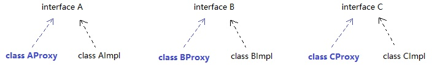

2.在创建代理对象时，通过构造器塞入一个目标对象，然后在代理对象的方法内部调用目标对象同名方法，并在调用前后打印日志。也就是说，**代理对象 = 增强代码 + 目标对象（原对象）**。有了代理对象后，就不用原对象了

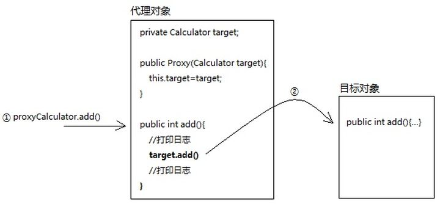


**静态代理的缺陷**

程序员要手动为每一个目标类编写对应的代理类。如果当前系统已经有成百上千个类，工作量太大了。所以，现在我们的努力方向是：如何少写或者不写代理类，却能完成代理功能？

**复习对象的创建**

很多初学Java的朋友眼中创建对象的过程

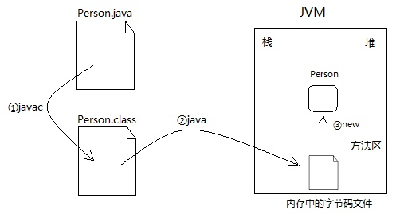


实际上可以换个角度，也说得通

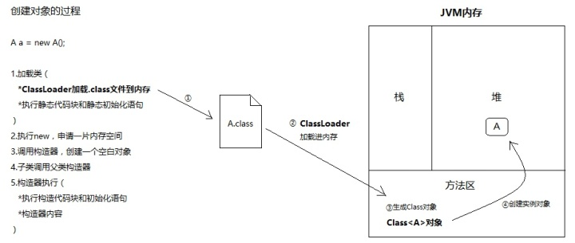


所谓的Class对象，是Class类的实例，而Class类是描述所有类的，比如Person类，Student类

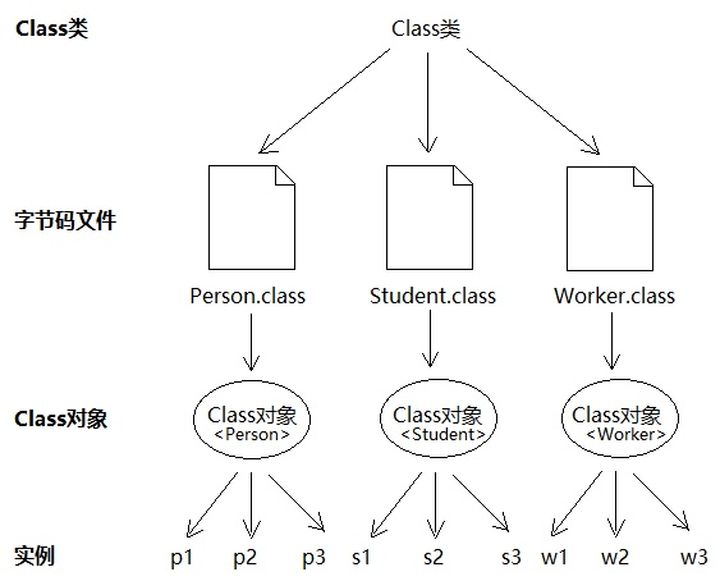


可以看出，要创建一个实例，最关键的就是**得到对应的Class对象。**只不过对于初学者来说，new这个关键字配合构造方法，实在太好用了，底层隐藏了太多细节，一句 Person p = new Person();直接把对象返回给你了。我自己刚开始学Java时，也没意识到Class对象的存在。

分析到这里，貌似有了思路：

**能否不写代理类，而直接得到代理Class对象，然后根据它创建代理实例（反射）。**

**Class对象包含了一个类的所有信息，比如构造器、方法、字段等**。如果我们不写代理类，这些信息从哪获取呢？苦思冥想，突然灵光一现：代理类和目标类理应实现同一组接口。**之所以实现相同接口，是为了尽可能保证代理对象的内部结构和目标对象一致，这样我们对代理对象的操作最终都可以转移到目标对象身上，代理对象只需专注于增强代码的编写。**还是上面这幅图：


所以，可以这样说：**接口拥有代理对象和目标对象共同的类信息**。所以，我们可以从接口那得到理应由代理类提供的信息。但是别忘了，接口是无法创建对象的，怎么办？


### Jdk动态代理

JDK提供了java.lang.reflect.InvocationHandler接口和 java.lang.reflect.Proxy类，这两个类相互配合，入口是Proxy，所以我们先聊它。

Proxy有个静态方法：getProxyClass(ClassLoader, interfaces)，**只要你给它传入类加载器和一组接口，它就给你返回代理Class对象。**

用通俗的话说，getProxyClass()这个方法，会从你传入的接口Class中，“拷贝”类结构信息到一个新的Class对象中，但新的Class对象带有构造器，是可以创建对象的。打个比方，一个大内太监（接口Class），空有一身武艺（类信息），但是无法传给后人。现在江湖上有个妙手神医（Proxy类），发明了克隆大法（getProxyClass），不仅能克隆太监的一身武艺，还保留了小DD（构造器）...（这到底是道德の沦丧，还是人性的扭曲，欢迎走进动态代理）

所以，一旦我们明确接口，完全可以通过接口的Class对象，创建一个代理Class，通过代理Class即可创建代理对象。

大体思路:

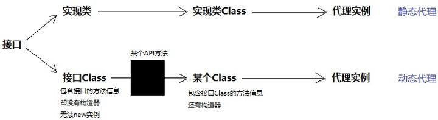

静态代理:

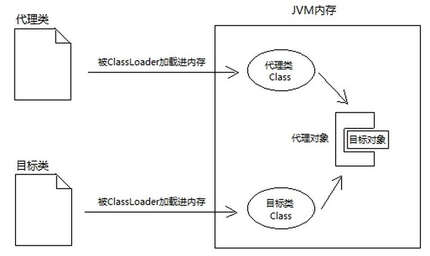

动态代理:

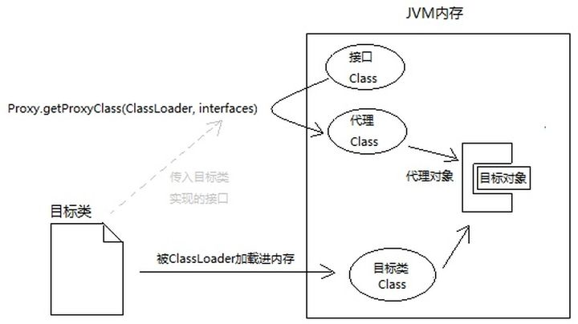

所以，按我理解，Proxy.getProxyClass()这个方法的本质就是：**以Class造Class。**

有了Class对象，就很好办了，具体看代码：

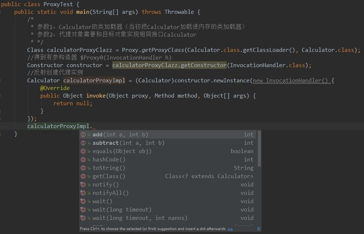

完美。

根据**代理Class的构造器创建对象时，需要传入InvocationHandler**。每次调用代理对象的方法，最终都会调用InvocationHandler的invoke()方法：

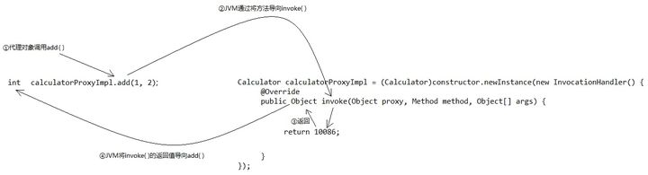

怎么做到的呢？

上面不是说了吗，根据代理Class的构造器创建对象时，需要传入InvocationHandler。**通过构造器传入一个引用，那么必然有个成员变量去接收。**没错，代理对象的内部确实有个成员变量invocationHandler，而且**代理对象的每个方法内部都会调用handler.invoke()**！InvocationHandler对象成了代理对象和目标对象的桥梁，不像静态代理这么直接。

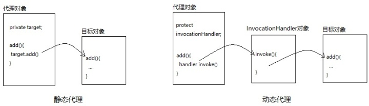


大家仔细看上图右侧的动态代理，我在invocationHandler的invoke()方法中并没有写目标对象。因为一开始invocationHandler的invoke()里确实没有目标对象，需要我们手动new。

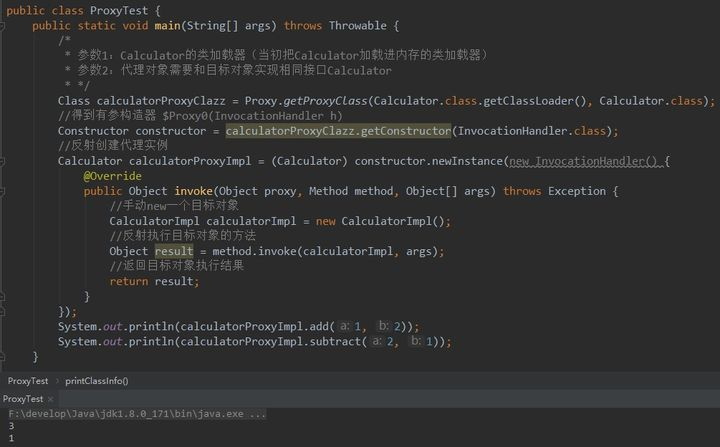


但这种写法不够优雅，属于硬编码。我这次代理A对象，下次想代理B对象还要进来改invoke()方法，太差劲了。改进一下，让调用者把目标对象作为参数传进来：

```java
public class ProxyTest {
	public static void main(String[] args) throws Throwable {
		CalculatorImpl target = new CalculatorImpl();
                //传入目标对象
                //目的：1.根据它实现的接口生成代理对象 2.代理对象调用目标对象方法
		Calculator calculatorProxy = (Calculator) getProxy(target);
		calculatorProxy.add(1, 2);
		calculatorProxy.subtract(2, 1);
	}

	private static Object getProxy(final Object target) throws Exception {
		//参数1：随便找个类加载器给它， 参数2：目标对象实现的接口，让代理对象实现相同接口
		Class proxyClazz = Proxy.getProxyClass(target.getClass().getClassLoader(), target.getClass().getInterfaces());
		Constructor constructor = proxyClazz.getConstructor(InvocationHandler.class);
		Object proxy = constructor.newInstance(new InvocationHandler() {
			@Override
			public Object invoke(Object proxy, Method method, Object[] args) throws Throwable {
				System.out.println(method.getName() + "方法开始执行...");
				Object result = method.invoke(target, args);
				System.out.println(result);
				System.out.println(method.getName() + "方法执行结束...");
				return result;
			}
		});
		return proxy;
	}
}
```

这样就非常灵活，非常优雅了。无论现在系统有多少类，只要你把实例传进来，getProxy()都能给你返回对应的代理对象。就这样，我们完美地跳过了代理类，直接创建了代理对象！


不过实际编程中，一般不用getProxyClass()，而是使用Proxy类的另一个静态方法：Proxy.newProxyInstance()，直接返回代理实例，连中间得到代理Class对象的过程都帮你隐藏：

```java
public class ProxyTest {
	public static void main(String[] args) throws Throwable {
		CalculatorImpl target = new CalculatorImpl();
		Calculator calculatorProxy = (Calculator) getProxy(target);
		calculatorProxy.add(1, 2);
		calculatorProxy.subtract(2, 1);
	}

	private static Object getProxy(final Object target) throws Exception {
		Object proxy = Proxy.newProxyInstance(
				target.getClass().getClassLoader(),/*类加载器*/
				target.getClass().getInterfaces(),/*让代理对象和目标对象实现相同接口*/
				new InvocationHandler(){/*代理对象的方法最终都会被JVM导向它的invoke方法*/
					public Object invoke(Object proxy, Method method, Object[] args) throws Throwable {
						System.out.println(method.getName() + "方法开始执行...");
						Object result = method.invoke(target, args);
						System.out.println(result);
						System.out.println(method.getName() + "方法执行结束...");
						return result;
					}
				}
		);
		return proxy;
	}
}
```


现在，我想题主应该能看懂动态代理了。

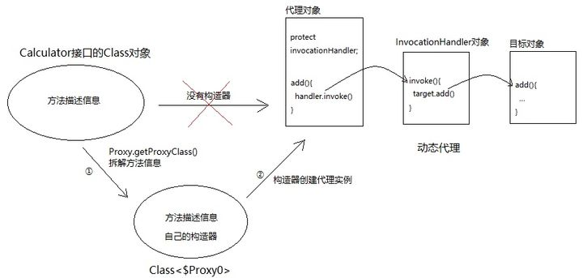


最后讨论一下代理对象是什么类型。

首先，请区分两个概念：代理Class对象和代理对象。

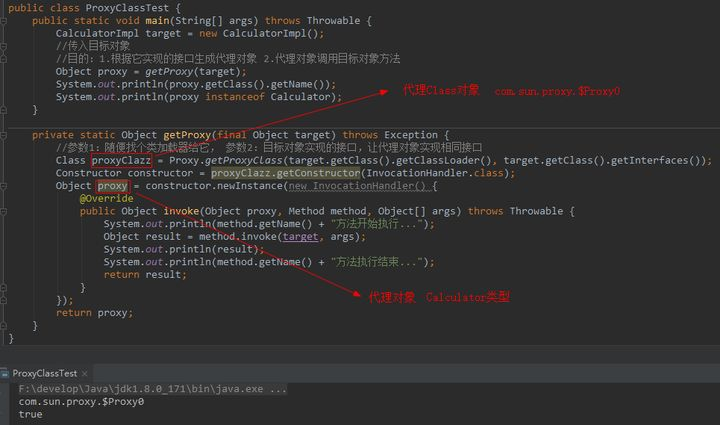

单从名字看，代理Class和Calculator的接口确实相去甚远，但是我们却能将代理对象赋值给接口类型：

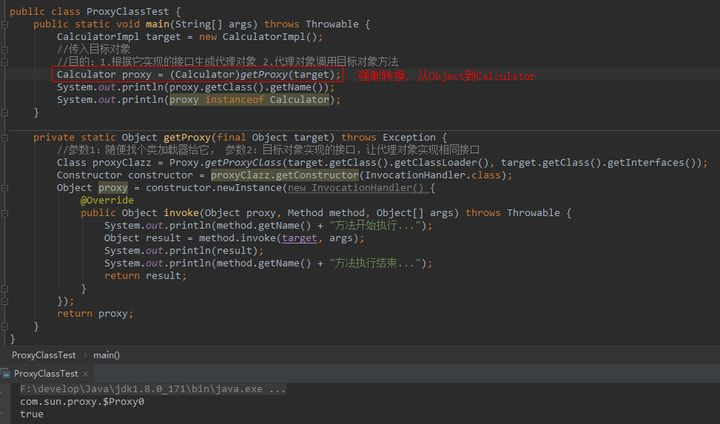

千万别觉得名字奇怪，就怀疑它不能用接口接收，只要实现该接口就是该类型。

> 代理对象的本质就是：和目标对象实现相同接口的实例。代理Class可以叫任何名字，whatever，只要它实现某个接口，就能成为该接口类型。


### **小结**
我想了个很骚的比喻，希望能解释清楚：
接口Class对象是大内太监，里面的方法和字段比做他的一身武艺，但是他没有小DD（构造器），所以不能new实例。一身武艺后继无人。
那怎么办呢？
正常途径（implements）：
写一个类，实现该接口。这个就相当于大街上拉了一个人，认他做干爹。一身武艺传给他，只是比他干爹多了小DD，可以new实例。
非正常途径（动态代理）：
通过妙手圣医Proxy的克隆大法（Proxy.getProxyClass()），克隆一个Class，但是有小DD。所以这个克隆人Class可以创建实例，也就是代理对象。
代理Class其实就是附有构造器的接口Class，一样的类结构信息，却能创建实例。


例：

```java
public class ProxyTest {
    static private Target target = new Target();
    //获得增强对象
    static private Advice advice = new Advice();
    public static void main(String[] args) {
        TargetInterface proxy = (TargetInterface) Proxy.newProxyInstance(
                target.getClass().getClassLoader(),//目标对象的类加载器
                target.getClass().getInterfaces(),//目标对象相同的接口字节码对象
                new InvocationHandler() {
                    //调用代理对象是实际执行invoke方法
                    public Object invoke(Object proxy, Method method, Object[] args) throws Throwable {
                        //这里的invoke是通过反射执行方法
                        advice.before();
                        method.invoke(target, args);
                        advice.after();
                        return null;
                    }
                }
        );
        proxy.save();
    }
}
```


### cglib动态代理

例：

```java
public class ProxyTest {
    static private Target target = new Target();
    //获得增强对象
    static private Advice advice = new Advice();
    //返回值 就是动态生成的代理对象 基于cglib
    public static void main(final String[] args) {
        //1.创建增强器
        Enhancer enhancer = new Enhancer();
        //2.设置父类
        enhancer.setSuperclass(Target.class);
        //3.设置回调
        enhancer.setCallback(new MethodInterceptor() {
            public Object intercept(Object o, Method method, Object[] objects, MethodProxy methodProxy) throws Throwable {
                advice.before();
                Object invoke = method.invoke(target,args);
                advice.after();
                return invoke;
            }
        });
        //4.创建代理对象 此处是父子关系
        Target proxy = (Target) enhancer.create();
        proxy.save();
    }
}
```


### AOP相关概念

Spring的AOP实现底层是对上面的动态代理的代码进行了封装，封装后我们只需要对需要关注的部分进行代码编写，并通过配置的方式完成指定目标方法的增强

在正式讲解APO的操作之前，我们必须理解AOP的相关术语，常用的术语如下：

* Target（目标对象）：代理的目标对象
* Proxy（代理）：一个类被AOP织入增强后，就产生了一个结果代理类
* Joinpoint（连接点）（可以被增强的方法）：所谓的连接点是指那些被拦截到的点，在spring中，这些点指的是方法。因为spring只支持方法类型的连接点
* Pointcut（切入点）（在程序运行过程中被增强的方法称为切入点；就是实际被配置了的连接点）：所谓的切入点是指我们要对哪些Joinpoint进行拦截的定义。
* Advice（通知、增强）：所谓通知就是拦截到Joinpoint之后要做的事情（就是增强方法）
* Aspect（切面）（切入点+通知、增强）：是切入点和通知（引介）的结合。
* Weaving（织入）：是指把增强应用到目标对象来创建新的代理对象的过程。spring采用动态代理织入，而AspectJ采用编译器织入和类装载期织入


